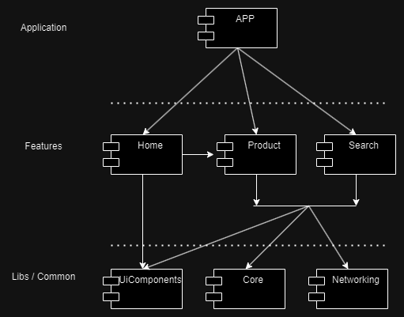
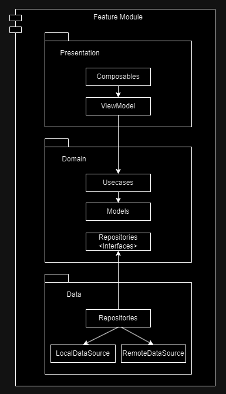

# Mercado Libre 

|   Personal Info    |                                 |
|-------|---------------------------------|
| Name  | Christian Alfredo Chamorro Vela |
| Email | chamorro.vela@gmail.com         |
| Phone | +57 3016611974                  |

 
MercadoLibre - Search es una aplicación de prueba donde se consume el API pública de Mercado Libre y se almacena de forma local los productos favoritos y el historial de busqueda

## Demo

## Architecture

El proyecto fue estructurado en modulos para aplicación, features y librerias comúnes, esto permite que cada módulo sea reutilizable y tenga una responsabilidad única.

|Module|Description|
|---|---|
|**App**|Este módulo integra toda la aplicación y maneja la navegación.|
|**Features**|Módulos que representan una caracteristica que peude ser reutilizada o intercambiable.|
|**Commons**|Librerias y utilidades que son usadas por los features.|

Cada feature module se basa en arquitectura limpia segmentando las capas de presentación, dominio y data.

|Layer|Description|
|---|---|
|**Domain**|Esta capa define la lógica y reglas de negocio a través de los usecases y models, adicionalmente define los repositorios para acceder a la información.|
|**Presentation**|Capa de presentación donde se define los composables, screens y viewmodels para manejar el estado de las vistas, depende de la capa de domain.|
|**Data**|Capa para el acceso a datos que implementa los repositorios definidos en domain y los data sources locales y remotos.|

## Code Quality

Para asegurar la calidad del código se usaron las siguientes herramientas 

|Tool|Description|
|---|---|
|**Unit Testing**|Se implementaron pruebas unitarias en repositorios y usecases usando junit y la libreria Mockk.|
|**Ktlint**|Linter paraverificar el estilo y calidad de código.|
|**Manual regregressions**|Pruebas funcionales con emulador siguiendo los flujos de los requerimientos.|
|**Crashalytics**|Herramienta de firebase para loggear errores.|

## Libraries

Para el desarrollo de estre proyecto se usaron las siguientes librerias:

|Library|Description|
|---|---|
|**Room**|Libreria oficial de android para el almacenamiento en base de datos sqlite.|
|**Retrofit**|Libreria para implementar cliente http.|
|**Jetpack Compose**|Libreria oficial de android para la implementacion de ui con composables.|
|**Coil**|Libreria para la carga y caché de imagenes.|
|**Mockk**|Libreria para la implementación de mocks y stubs en pruebas unitarias.|
|**Hilt**|Libreria oficial de android para la inyección de dependencias.|